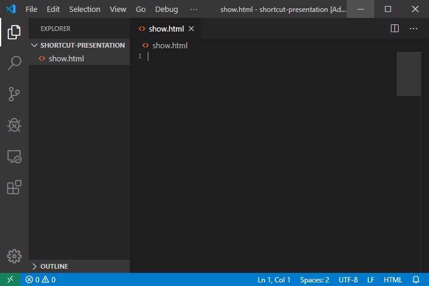

[淘宝网](http://www.taobao.com/)


> 这里的内容在内容块中

> 嵌套区块 这里我只介绍一下我常用的方法，也是个人认为比较规范的一种方法，就是给区块的下一级区块多加一个右尖括号

> 一级引用
>> 二级引用
>>> 三级引用
>>>> 四级引用
>>>>> 五级引用
>>>>>> 六级引用

> 标题 1.前面带#号，后面带文字，分别表示h1-h6,只到h6，而且h1下面会有一条横线

# 一级标题

## 二级标题

### 三级标题

#### 四级标题

##### 五级标题

###### 六级标题

2.相当于标签闭合

# 一级标题 #

## 二级标题 ##

### 三级标题 ###

#### 四级标题 ####

##### 五级标题 #####

###### 六级标题 #####

> 无序列表

+ a
+ b
+ c

- d
- e
- f

* g
* h
* i

> 嵌套列表

无序列表嵌套

+ 123
    + abc
    + bcd
    + cde
+ 465
+ 789

有序列表嵌套

1. abcd
    1. abcde
    2. abcde
    3. abcde
2. bcde
3. cdef

> 分割线
---
- - -
------
***
* * *
******
___
_ _ _
______

> 强调字体

*md*    
**md**
_md_   
__md__
~~md~~

> 表格

-: 设置内容和标题栏居右对齐。
:- 设置内容和标题栏居左对齐。
:-: 设置内容和标题栏居中对齐。

|Column1|Column2|Column3|
|:-----|:-----:|-----:|
|abc|bcd|cde|
|abc|bcd|cde|
|abc|bcd|cde|

> 代码块

单行代码

`hello`

多行代码

```
daliangdaima,xuyaoduohangshiyong
daliangdaima,xuyaoduohangshiyong
daliangdaima,xuyaoduohangshiyong
daliangdaima,xuyaoduohangshiyong
daliangdaima,xuyaoduohangshiyong 
```

插入图片


 
 